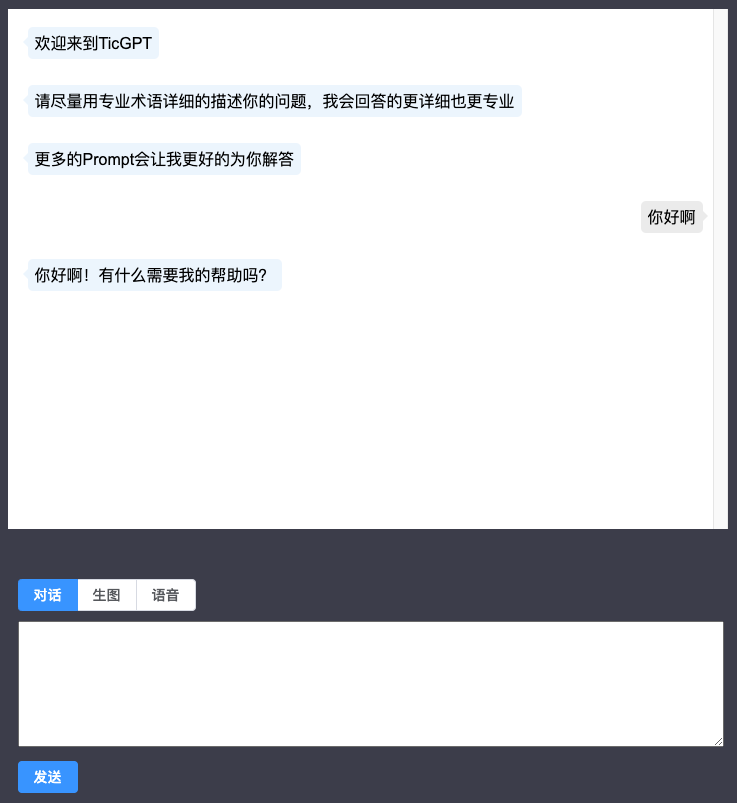
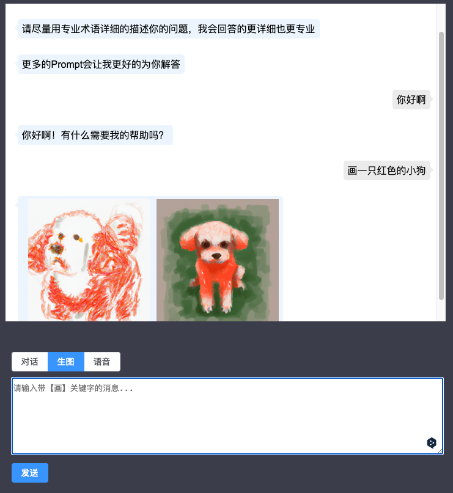
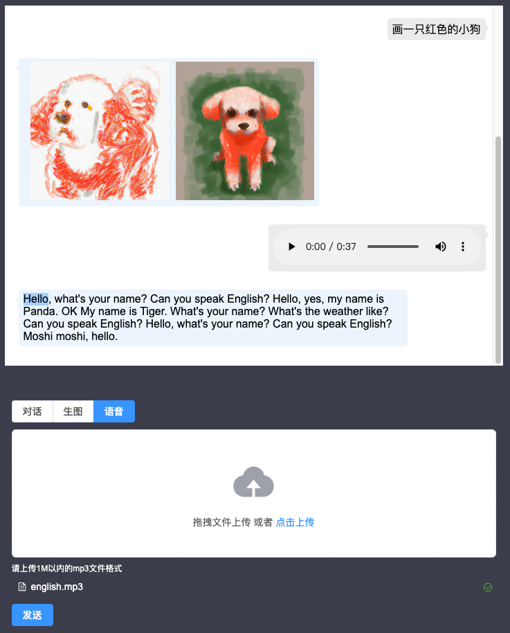
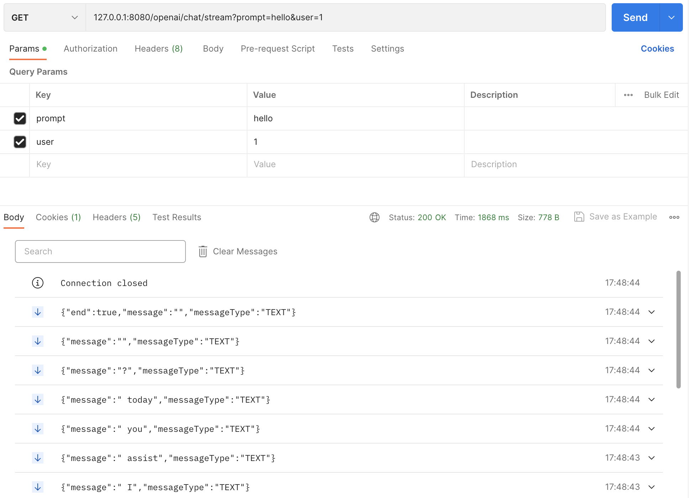
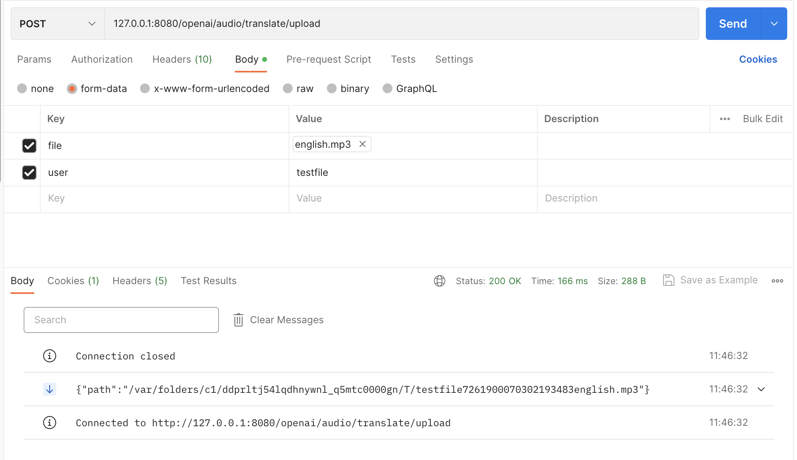
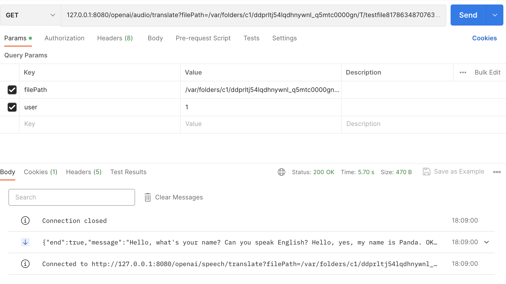

## 🔥🔥🔥手动打造一个属于你自己的ChatGPT🔥🔥🔥
#### ✨使用万能的SpringBoot轻松对接OpenAi接口使用ChatGpt完成一些基本功能，无第三方jar包；
#### ✨服务端使用webflux完成流式处理，html里面使用EventSource接收数据实现流式效果；
#### ✨聊天界面如果有代码显示，可自动高亮代码块，其他功能可自己扩展，构建一个属于自己的ChatGPT；

已完成功能

#### ✅  1. 完成对话，可生成代码及代码高亮

#### ✅  2. 生成图片，直接在对话框中进行图片预览

#### ✅  3. 完成ASR的功能，上传一段音频，完成语音转文字

效果图如下：








后续功能
- [ ] 查询余额，避免过度消耗；
- [ ] 限制聊天次数和长度，避免被刷；
- [ ] 记录聊天历史，有迹可循；
- [ ] 接入TTS，完成文字转语音；
- [ ] 接入MidJourney;
- [ ] 接入D-ID，实现文字生成视频；
- [ ] 接入OpenAI的其他接口，完成一些demo；
- [ ] 接入微信小程序；


前端代码简单示例：
javascript示例
```javascript
// message为需要发送的消息
const eventSource = new EventSource(`127.0.0.1:8080/openai/chat/stream?prompt=${message}&user=${user}`);
// 收到消息处理
eventSource.onmessage = function(event) {
    // 略...
}
```
vue示例
```vue
const eventSource = new EventSource(`127.0.0.1:8080/openai/chat/stream?prompt=${message}&user=${user}`);

sse.addEventListener('open', (function () {
    console.log('open')
}))

sse.addEventListener('message', function (res) {
    console.log(res.data)
}))

sse.addEventListener('error', function () {
    console.log('error')
}))
```


后端代码简单示例（注意`produces = MediaType.TEXT_EVENT_STREAM_VALUE`不能少）：
```java
@RestController
@RequestMapping("/openai")
@RequiredArgsConstructor
public class ChatController {

    private final UserChatService userChatService;
    
    @GetMapping(value = "/chat/stream", produces = MediaType.TEXT_EVENT_STREAM_VALUE)
    public Flux<String> streamCompletions(String prompt, String user) {
        Assert.hasLength(user, "user不能为空");
        Assert.hasLength(prompt, "prompt不能为空");
        return userChatService.send(MessageType.TEXT, prompt, user);
    }
}
```
postman示例图

<br/>

<br/>

<br/>


```yaml
openai:
  urls:
    moderations: "https://api.openai.com/v1/moderations"
    completions: "https://api.openai.com/v1/completions"
    edits: "https://api.openai.com/v1/edits"
    chat-completions: "https://api.openai.com/v1/chat/completions"
    list-models: "https://api.openai.com/v1/models"
    retrieve-model: "https://api.openai.com/v1/models/{model}"
    embeddings: "https://api.openai.com/v1/embeddings"
    list-files: "https://api.openai.com/v1/files"
    upload-file: "https://api.openai.com/v1/files"
    delete-file: "https://api.openai.com/v1/files/{file_id}"
    retrieve-file: "https://api.openai.com/v1/files/{file_id}"
    retrieve-file-content: "https://api.openai.com/v1/files/{file_id}/content"
    create_fine_tune: "https://api.openai.com/v1/fine-tunes"
    list_fine_tune: "https://api.openai.com/v1/fine-tunes"
    retrieve_fine_tune: "https://api.openai.com/v1/fine-tunes/{fine_tune_id}"
    cancel_fine_tune: "https://api.openai.com/v1/fine-tunes/{fine_tune_id}/cancel"
    list_fine_tune_events: "https://api.openai.com/v1/fine-tunes/{fine_tune_id}/events"
    delete_fine_tune_events: "https://api.openai.com/v1/models/{model}"
    create-transcription: "https://api.openai.com/v1/audio/transcriptions"
    create-translation: "https://api.openai.com/v1/audio/translations"
    create_image: "https://api.openai.com/v1/images/generations"
    create_image_edit: "https://api.openai.com/v1/images/edits"
    create_image_variation: "https://api.openai.com/v1/images/variations"
    billing-credit-grants: "https://api.openai.com/dashboard/billing/credit_grants"
    users: "https://api.openai.com/v1/organizations/{organizationId}/users"
    billing-subscription: "https://api.openai.com/v1/dashboard/billing/subscription"
    billing-usage: "https://api.openai.com/v1/dashboard/billing/usage?start_date={start_date}&end_date={end_date}"
```
